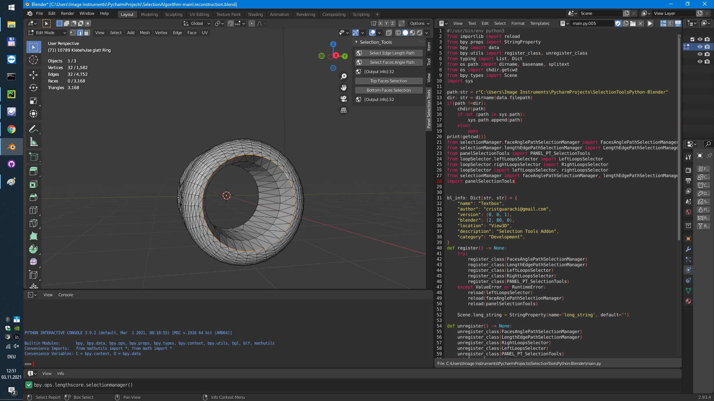

# EDGE SELECTION ALGORITHM 
 
Hierbei werden ähnliche Kanten gesucht, die die gleichen ausgewählten Parameter (Länge oder Winkel) haben wie die ursprüngliche aktiv-selektierte Kante.




### Selection Manager 

Die Modulen **"FacesAnglePathSelectionManager"** und **"LengthEdgePathSelectionManager"** sind prinzipiell Implementierungen von Operator(bpy_struct), wobei das Object 'StateEdges' mit den BMEdge-Elemente instanziiert wird. 
In beiden Klassen werden die StateEdge-Objekte in eine Priority Queue gespeichert, da diese aufgrund ihrer Eigenschaften (z.B. Winkel oder Länge) die miteinander vergleichen werden können. Dies findet in der Klassenmethode *__constructEdgePath* statt, welche in der execute Methode aufgerufen und an Blender weitergegeben wird.
Diese Klassenmethode liefert eine Liste der selektierte BMEdges zurück

```python

from bmesh.types import BMElemSeq, BMEdgeSeq, BMFaceSeq, BMVertSeq
from bmesh.types import BMVert, BMEdge, BMFace, BMesh, BMLoop
from bpy import context
from bpy.types import Object, Operator, Panel, ID
from bmesh import from_edit_mesh, update_edit_mesh
from typing import List, Set
from queue import PriorityQueue
from state_edge.stateEdges import StateEdge

class LengthEdgePathSelectionManager(Operator):
    bl_idname: str = 'lengthscore.selectionmanager';
    bl_label: str = 'show searching path based on edge length';
    bl_options: Set[str] = {'REGISTER', 'UNDO'};
    ... 
 ```
Da es sich um eine Klasse handelt, die von dem Operator vererbt und durch Blender zugegriffen wird, werden bestimmte Identifikationseigenschaften zugeschrieben. **"bl_idname"** ist der Name des Objekts mit dem die Klasse in Blender registriert und ausgeführt wird. 
bl_label ist der String mit dem die Klasse beschrieben wird.
```python
    def __constructEdgePath(self) -> List[BMEdge]:
        visited: List[int] = self.__excludeDuplicates() 
        nextEdge:BMEdge;
        parentNode:bool;
        actions:List[BMEdge]=list();
        # -------- clear dict EXTENDED NODES
        self.__deleteAllEdges()
        # ------------ declare and define StateEdges, first call has none SCORE
        state:StateEdge = StateEdge(parent=None,action=self.__selectedEdges[0]);
        # ------ create children-edges
        state.createChildrenEdges(scoreAngle=False);
        # ------ save the RAND LIST as a priority queue
        self.__randListe(state)
        while(True): # endlose Schleife
            # ------ look for the next edge and save in SELECTED EDGES
            nextEdge = self.__priorityQueue.get()
            assert (nextEdge is not None), 'there is none new selected edge'
            if(nextEdge.action == state.goal):
                visited.append(nextEdge.action.index);
                state = StateEdge(parent=state, action=nextEdge.action);
                self.__selectedEdges.append(state.action);
                self.__addStatesToRandList(state)
                actions.append(self.__extractStatesParents(state))
                break;
            elif(nextEdge.action.index not in visited):
                start+=1;
                visited.append(nextEdge.action.index);
                self.__selectedEdges.append(nextEdge.action)
            elif(nextEdge.action.index in visited):
                continue
            # -------- check if parent node in current edge
            parentNode = self.__checkNodeInStatus(nextEdge,state)
            # ------- save the last node, action and children into the class itself
            if(parentNode is True):
                state = StateEdge(state, nextEdge.action)
                # ------ calculate the score for the current edge
                state.calculateTheScore(angleScore=True)
            else:
                # ------ the last state will be saved into the priority queue
                self.__addStatesToRandList(state);
                state = nextEdge
            # ------ create children-edges
            state.createChildrenEdges(scoreAngle=True);
            # -------- save the status in EXTENDED NODES
            self.__randListe(state);
        return actions
```
Um den Suchbaum zu konstruieren, werden erstmal aus den selektierten MBEdges Duplikaten ausgelassen, die mit selektiert werden konnten. 
Als erster Schritt werden die BMEdges als States definiert und somit initialisiert. Für jeden Schritt wird ein BMEdge aus einer Menge von aktiven BMEdges selektiert, die das genutzte Kriterium (bspw. gleiche Länge bzw. Winkel) erfüllt ([siehe](state_edges.md) Klassenmethode *calculateTheScore*). 
Ausgehend von der selektierten Kante (BMEdge) werden wiederum alle verbundenen Kanten betrachtet (siehe [Expandieren](https://de.wikipedia.org/wiki/A*-Algorithmus)). Das geschieht hier anhand der Klassenmethode *createChildrenEdges* der Klasse **StateEdges**.
Die Randliste des Suchbaums wird als eine Priority Queue gespeichert, sodass sich die niedrigsten Werte vorne befinden. 
Diese Suchstrategie wird so lang durchgeführt bis man bei der weider Ausgangskante ankommt. In diesem Suchalgorithmus ist die Ausgangskante gleich zu dem Zielkante. 

```python

    def __activateEdgesEDITMODE(self,EDGES:List[List[BMEdge]]) -> None:
        i:int;
        currEdge:BMEdge;
        for i in range(len(EDGES[0])):
            currEdge = EDGES[0][i]
            currEdge.select=True;
            self.__bm.select_history.clear();
            self.__bm.select_history.add(currEdge);
        update_edit_mesh(self.__obj.data)
```
Die Aktivierung und Selektion der BMMesh Elemente (BMEdges) werden hier durch die Klassenmethode *__activateEdgesEDITMODE* implementiert. Hierdurch werden die aktivierte BMEdges selektiert und im EDIT MODE veranschaulicht. 
Hier wird durch den aus *__constructEdgePath* resultierenden Suchpfad iteriert, um alle bereits selektierte BMEdges zu aktivieren, sodass sie in EDIT MODE sichtbar gemacht werden können. Dafür greift man in den Verlauf der Selektion von BMesh-Elemente zu und packt die jede Kante aus dem Suchpfad mit ein. 

```python
    def execute(self, context) -> Set[str]:
        actions:List[List[BMEdge]];
        self.__selectedEdges.clear()
        try:
            self.__setSelectedEdges()
            assert(len(self.__selectedEdges)>0),'None Edge was selected, please select a edge in EDIT MODE'
            actions = self.__constructEdgePath()
            self.__activateEdgesEDITMODE(actions)
            context.scene.long_string = '[Output Info]:{}'.format(len(actions[0]))
            return {'FINISHED'}
        except Exception as e:
            self.report({'ERROR'}, e.args)
            return {'CANCELLED'}
```

